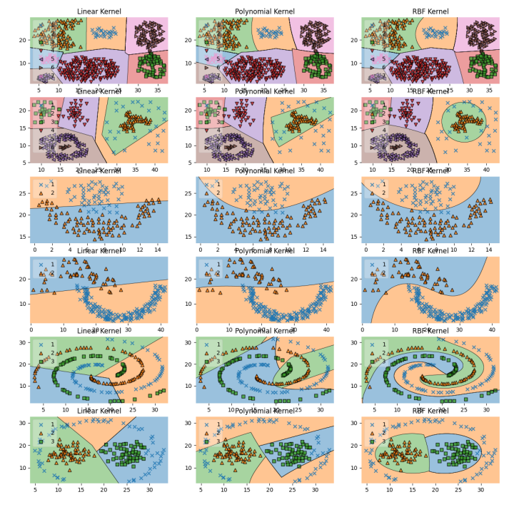

# 🧠 SVM Kernel Comparison on Diverse Datasets

This project benchmarks the performance of Support Vector Machine (SVM) classifiers using different kernel functions — **Linear**, **RBF**, and **Polynomial** — across a variety of structured datasets. It includes automated hyperparameter tuning and visualizations of decision boundaries.

## 📊 Objective
To evaluate how kernel choice and tuning parameters affect classification accuracy and decision boundaries across diverse datasets.

## 📁 Datasets Used
- Aggregation
- Compound
- Flame
- Jain
- Spiral
- Pathbased

## ⚙️ Tech Stack
- **Programming Language:** Python
- **Libraries:**  
  `NumPy`, `Pandas`, `Scikit-learn`, `GridSearchCV`,  
  `Matplotlib`, `Seaborn`, `MLxtend`, `itertools`, `TQDM`

## 🚀 Features
- Compare multiple SVM kernels across real-world datasets
- Apply `GridSearchCV` for optimal hyperparameters
- Visualize decision regions using `MLxtend`
- Summarize results with accuracy scores and plots

## 📷 Sample Output

